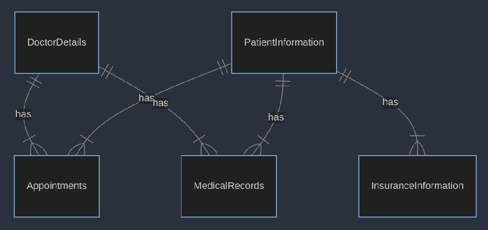

# Design Document

OSAMA MAHER ALRIFAI

## Scope

This database is designed to organize information on patient care. Its primary purpose is to facilitate easy access to patient records, doctor information, appointment scheduling, medical records, and medication details.

In Scope: People: Doctors, Patients. Processes: Appointment scheduling, medical record keeping, insurance information management. Data: Doctor details, patient information, appointment dates and times, medical histories, medication information.

Out of Scope: People: Non-medical staff. Processes: Financial transactions (billing, payment processing). Data: Detailed laboratory test results
## Functional Requirements

User Capabilities: Users can add, view, update, and delete patient details. Access information about doctors, including specialties. Users can create, view, update, and cancel appointments. Access medical records. Store and retrieve data about medications.

Beyond Scope The system is not designed for direct messaging or telemedicine functionalities.

## Representation
Entities are captured in SQLite tables with the following schema.

### Entities

The database includes the following entities:

DoctorDetails
The DoctorDetails table includes:

DoctorID, data Type: INTEGER This is the primary key for the table. Being an INTEGER, it's efficient for indexing and searching.

FirstName, data Type: TEXT This field is set to NOT NULL, meaning it must always have a value. It stores the first name of the doctor.

LastName, data Type: TEXT This field is also NOT NULL, ensuring that every record has a last name value.
Specialty, data Type: TEXT This optional field can store the medical specialty of the doctor.
Email, data Type: TEXT This field is for storing the doctor's email address. It’s optional and not constrained to be unique in this structure.
Phone, data Type: TEXT This field is for the doctor's phone number.

### Relationships

The below entity relationship diagram describes the relationships among the entities in the database.

ER Diagram

Patient-Doctor Relationship: A many-to-many relationship exists, as one patient can have appointments with multiple doctors, and one doctor can see multiple patients.

Patient-Insurance Relationship: A one-to-many relationship, as one patient can have multiple insurance policies, but each policy is specific to one patient.

Doctor-Appointments and Patient-Appointments: These are many-to-one relationships, where multiple appointments can be linked to one doctor or one patient.

Patient-MedicalRecords Relationship: A one-to-many relationship, as one patient can have multiple medical records.
## Optimizations

Indexes: Created on frequently queried fields like LastName in DoctorDetails and PatientInformation, and AppointmentDate in Appointments for faster search and retrieval.

Views: Defined for each major entity (like DoctorContactInfo, PatientContactInfo) to simplify data access and hide the complexity of underlying schema.

## Limitations

The current design may struggle under extremely large datasets or high transaction volumes.

The database does not efficiently represent more complex relationships (e.g., multiple doctors per appointment).

This database provides a foundational structure for managing healthcare-related information, suitable for small to medium-sized healthcare facilities.
